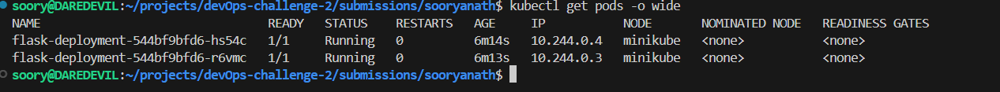
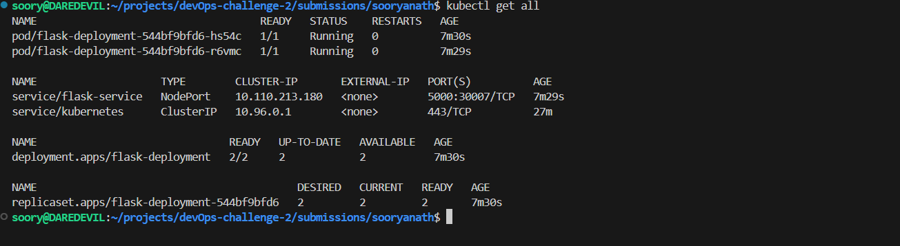
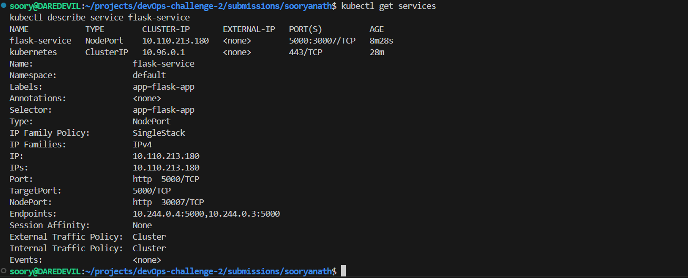
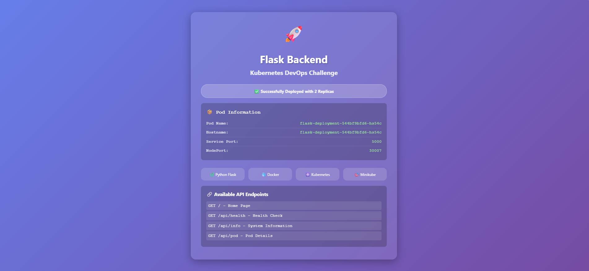

# Kubernetes Deployment Challenge - Sooryanath

## 🐳 DockerHub Image

**Repository:** https://hub.docker.com/r/sooryanath/flask-backend-challenge  
**Image:** `sooryanath/flask-backend-challenge:v1`  
**Pull Command:** `docker pull sooryanath/flask-backend-challenge:v1`

---

## 📁 Project Structure
```
submissions/sooryanath/
├── deployment.yaml              # Kubernetes Deployment configuration
├── service.yaml                # Kubernetes Service (NodePort)
├── Dockerfile                  # Docker build instructions
├── app_simple.py               # Flask application source code
├── requirements.txt            # Python dependencies
├── README.md                   # Documentation (this file)
└── screenshots/
    ├── pods-running.png        # kubectl get pods output
    ├── all-resources.png       # All Kubernetes resources
    ├── deployment-services.png # Deployment and service details
    └── app-browser.png         # Application running in browser
```

---

## 🚀 Deployment Details

### Application Specifications
- **Framework:** Flask (Python 3.9)
- **Base Image:** python:3.9-slim
- **Application Port:** 5000
- **Replicas:** 2 (for high availability)
- **Health Checks:** Liveness & Readiness probes configured

### Service Configuration
- **Service Name:** flask-service
- **Service Type:** NodePort
- **Port:** 5000
- **Target Port:** 5000
- **NodePort:** 30007

### API Endpoints
| Endpoint | Method | Description |
|----------|--------|-------------|
| `/` | GET | Home page with UI |
| `/api/health` | GET | Health check |
| `/api/info` | GET | Application info |
| `/api/pod` | GET | Pod details |

---

## 📸 Screenshots

### Pods Running (2 Replicas)


### All Kubernetes Resources


### Deployment & Service Status


### Application in Browser


---

## ⚙️ Commands Used

### Docker Commands
```bash
# Navigate to backend app directory
cd {{cookiecutter.project_slug}}/backend/app

# Build Docker image
docker build -t sooryanath/flask-backend-challenge:v1 .

# Test locally
docker run -p 5000:5000 sooryanath/flask-backend-challenge:v1

# Login to DockerHub
docker login

# Push to DockerHub
docker push sooryanath/flask-backend-challenge:v1
```

### Kubernetes Commands
```bash
# Start Minikube
minikube start

# Apply configurations
kubectl apply -f deployment.yaml
kubectl apply -f service.yaml

# Verify deployment
kubectl get pods
kubectl get deployments
kubectl get services
kubectl get all

# Access application
minikube service flask-service

# Check logs
kubectl logs -l app=flask-app

# Describe resources
kubectl describe deployment flask-deployment
kubectl describe service flask-service
```

### Testing Commands
```bash
# Get service URL
minikube service flask-service --url

# Test health endpoint
curl $(minikube service flask-service --url)/api/health

# Test application endpoints
curl $(minikube service flask-service --url)/api/info
curl $(minikube service flask-service --url)/api/pod
```

---

## ✅ Verification Checklist

- [x] Flask application containerized with Docker
- [x] Docker image built successfully
- [x] Image pushed to DockerHub (public repository)
- [x] Kubernetes Deployment created with 2 replicas
- [x] Kubernetes Service created with NodePort (30007)
- [x] Both pods running and healthy
- [x] Health checks (liveness & readiness) configured
- [x] Application accessible via Minikube service
- [x] All API endpoints working correctly
- [x] Screenshots captured and saved
- [x] Documentation completed

---

## 🔍 Technical Implementation

### Dockerfile Highlights
- Minimal base image (python:3.9-slim)
- Health check included
- Efficient layering
- Production-ready configuration

### Kubernetes Configuration Highlights
- Resource limits set (memory: 256Mi, CPU: 200m)
- Resource requests defined (memory: 128Mi, CPU: 100m)
- Environment variables passed from pod metadata
- Proper label selectors
- Health probes for reliability

---

## 🎯 Features Implemented

1. **Beautiful UI:** Responsive web interface with pod information
2. **Multiple Endpoints:** Health, info, and pod-specific endpoints
3. **Pod Awareness:** Application displays its own pod name and hostname
4. **Health Monitoring:** Liveness and readiness probes
5. **Resource Management:** Proper resource limits and requests
6. **High Availability:** 2 replicas for fault tolerance

---

## 🐛 Troubleshooting

### If pods are not starting:
```bash
kubectl describe pods -l app=flask-app
kubectl logs -l app=flask-app
```

### If service is not accessible:
```bash
kubectl get svc flask-service
minikube service flask-service --url
```

### To restart deployment:
```bash
kubectl rollout restart deployment flask-deployment
```

---

## 👤 Author

**Name:** Sooryanath G  
**GitHub:** [@sooryanathg](https://github.com/sooryanathg)  
**DockerHub:** [@sooryanath](https://hub.docker.com/u/sooryanath)  
**Challenge:** DevOps Challenge 2 - Kubernetes Deployment

---

## 📝 Notes

- This deployment uses Minikube for local Kubernetes cluster
- NodePort service type allows external access
- Application includes real-time pod information display
- All configurations follow Kubernetes best practices
- Based on cookiecutter full-stack template backend
